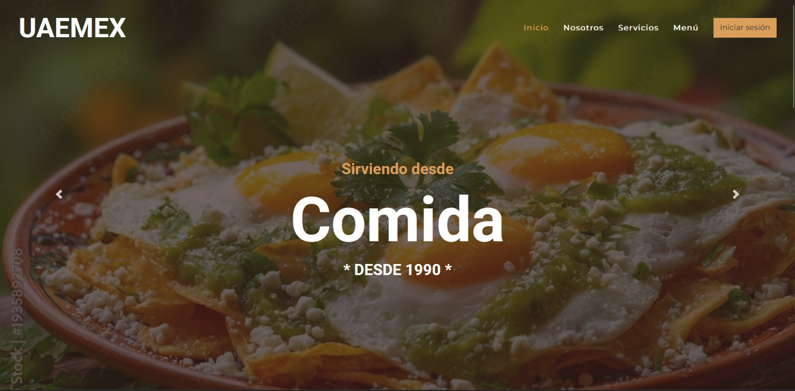
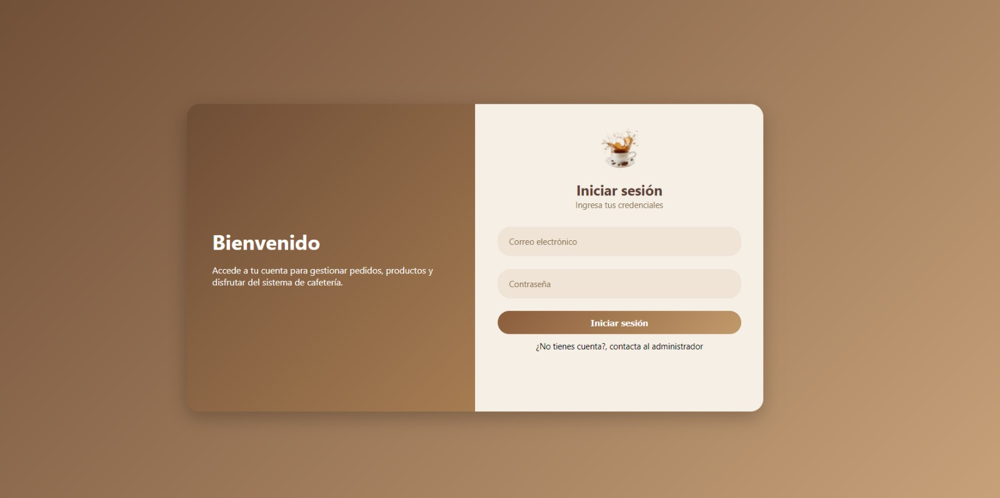
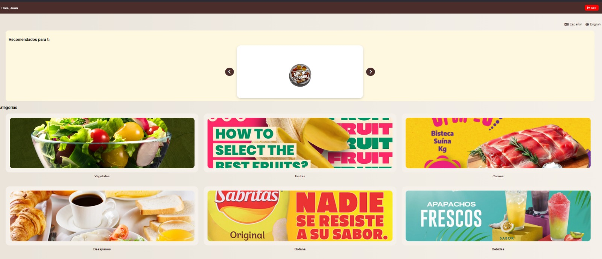

# Mi Cafetería UAEMéx

## Descripción

**Mi Cafetería UAEMéx** es un sistema desarrollado para optimizar la administración y operación de las cafeterías de la Universidad Autónoma del Estado de México (UAEMéx). La plataforma permite gestionar usuarios, sucursales, productos, inventarios y pedidos, además de incorporar un mecanismo para la validación de becas alimentarias digitales y el seguimiento del estado de las órdenes en tiempo real.

El objetivo principal del proyecto es mejorar la eficiencia en la atención a la comunidad universitaria mediante la digitalización de los procesos operativos de las cafeterías.

---

## Características

- Registro e inicio de sesión de usuarios.
- Administración de sucursales.
- Gestión de productos.
- Control de inventario.
- Registro y seguimiento de pedidos.
- Actualización del estado de preparación mediante semáforo digital.
- Validación de becas alimentarias digitales.
- Administración de usuarios y roles.

---

## Tecnologías utilizadas

- Java
- Java Swing
- Apache Ant
- NetBeans IDE
- JDBC
- MariaDB / MySQL

---

## Arquitectura

El sistema fue diseñado siguiendo el patrón de arquitectura **Modelo-Vista-Controlador (MVC)**, con el propósito de separar la lógica de negocio, la interfaz gráfica y el acceso a los datos, facilitando el mantenimiento y la escalabilidad del proyecto.

---

## Estructura del proyecto

```text
CafeteriaUaemex/
│
├── build/
├── capturas/
│   ├── captura1.png
│   ├── captura2.png
│   └── captura3.png
├── dist/
├── nbproject/
├── src/
├── README.md
├── build.xml
└── manifest.mf
```

---

## Capturas del sistema

### Pantalla principal

<p align="center">
    
</p>

---

### Gestión de pedidos

<p align="center">
    
</p>

---

### Administración del sistema

<p align="center">
    
</p>

---

## Instalación

### Clonar el repositorio

```bash
git clone https://github.com/TU-USUARIO/CafeteriaUaemex.git
```

### Abrir el proyecto

1. Abrir **Apache NetBeans**.
2. Seleccionar **Open Project**.
3. Elegir la carpeta **CafeteriaUaemex**.

### Configurar la base de datos

- Crear la base de datos en MariaDB o MySQL.
- Importar el script correspondiente.
- Configurar la conexión JDBC del proyecto.

### Ejecutar

Compilar y ejecutar el proyecto desde NetBeans.

---

## Funcionalidades principales

- Gestión de usuarios.
- Gestión de sucursales.
- Administración de productos.
- Control de inventario.
- Registro de pedidos.
- Seguimiento del estado de los pedidos.
- Administración de becas alimentarias.
- Gestión administrativa del sistema.

---

## Documentación

La documentación del proyecto incluye:

- Especificación de requerimientos.
- Casos de uso.
- Modelo entidad-relación.
- Diagrama de clases.
- Manual técnico.
- Manual de usuario.

---

## Autor

**Ramiro Vega**

Universidad Autónoma del Estado de México

Proyecto desarrollado con fines académicos para la asignatura correspondiente.

---

## Licencia

Este proyecto tiene fines exclusivamente académicos y educativos.
